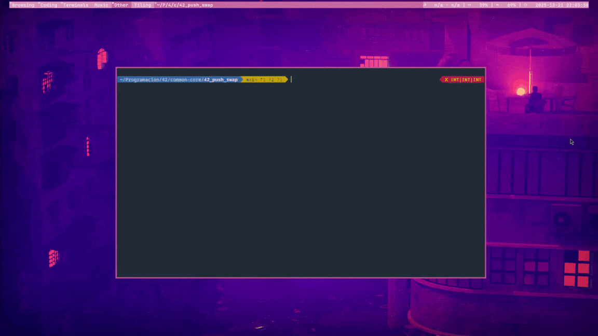

*This project has been created as part of the 42 curriculum by dde-fite*

<p align="center">
	
	<h1 align="center">42_push_swap</h1>
</p>

<p align="center">
	
</p>

<p align="center">
This work is published under the terms of <a href="LICENSE"><b>MIT license</b></a>
</p>

<div align="center">
	<h2>Return the operations needed to sort numbers using two stacks.</h2>
	
</div>

## Description
Massive and efficient number sorting has always been one of the most important challenges for the advancement of society. Today, every time we search for a video on YouTube or buy something at the supermarket, these sorting algorithms are working behind the scenes. This makes it essential for any programmer to have a broad knowledge of the subject.

The objective of push_swap is to delve into algorithms, searching for the most efficient way to sort numbers using two memory stacks and the operations: push, swap, rotate, and reverse rotate. We must create a program that accepts integers and returns the operations that must be performed to sort the numbers via stdout, followed by a line break.

``` bash
./push_swap 7 1 0 2 4
rra
rra
rra
pb
rra
pb
pa
pa

```

To achieve a 100% score, the algorithm must meet the following criteria:
- Sort 100 random numbers in fewer than 700 operations.
- Sort 500 random numbers in no more than 5500 operations.

Therefore, it is necessary to constantly check the number of operations to ensure that the limits are not exceeded.

### Program flow


## Instructions
### Requirements
The source code and Makefile are designed for use in a UNIX-like environment; any use outside this scope does not guarantee correct or efficient operation.
- Make
- GCC

### Installation
- Clone the repository recursively to download the submodules.
``` bash
git clone --recursive https://github.com/dde-fite/42_push_swap.git
```

- For the general section
``` bash
make
```

- For the bonus section.
``` bash
make bonus
```

### Usage
After compilation is complete, the push_swap file will appear. Run it with the numbers you want to sort as an argument.

``` bash
./push_swap 1 2 3 4 5 6 7 8 9 10
```

To call the bonus, you must pass the operations to be checked by stdint and the disordered numbers as arguments.

From the terminal, you can use it by executing a push_swap and calling the checker with a pipe (|).

``` bash
./push_swap 1 2 3 4 5 6 7 8 9 10 | ./checker 1 2 3 4 5 6 7 8 9 10
```

## Testings

In the repository, you can find a small script to quickly test push_swap.

It works by measuring the operations needed to sort 100 numbers and then running it through the checker five times, and then doing it again with 500 numbers another five times.

```fish
./test.fish
```

## Resources
- [(YT) All the Sorting Algorithms - Boot dev](https://www.youtube.com/watch?v=GMV7ycKZ-mM)
- [(YT) I Made Sorting Algorithms Race Each Other - Green Code](https://www.youtube.com/watch?v=N4JVT3eVBP8)
- [(YT) Learn Insertion Sort in 7 minutes 🧩 - Bro Code](https://www.youtube.com/watch?v=N4JVT3eVBP8)
- [(YT) Learn Selection Sort in 8 minutes 🔦 - Bro Code](https://www.youtube.com/watch?v=EwjnF7rFLns)
- [Sorting a Singly Linked List - GeeksforGeeks](https://www.geeksforgeeks.org/dsa/sorting-a-singly-linked-list/)
- [Push_Swap Turk algorithm explained in 6 steps - Yutong Deng](https://pure-forest.medium.com/push-swap-turk-algorithm-explained-in-6-steps-4c6650a458c0)
- [My journey to find a good sorting algorithm for the Push_Swap 42 project - MannBell](https://m4nnb3ll.medium.com/my-journey-to-find-a-good-sorting-algorithm-for-the-push-swap-42-project-4a18bc38b474)
- [Longest Increasing Subsequence (LIS) - GeeksforGeeks](https://www.geeksforgeeks.org/dsa/longest-increasing-subsequence-dp-3/)
- [exit(3) - Linux man-pages](https://man7.org/linux/man-pages/man3/exit.3.html)

### How AI was used
For this project, I have chosen to keep AI out of the picture so that it does not interfere with my understanding of the concepts of algorithmics.

## Got any suggestions?
If you find any errors or have any new ideas for improving this repository, feel free to open an Issue or Pull Request, or contact me at my email address: nora@defitero.com